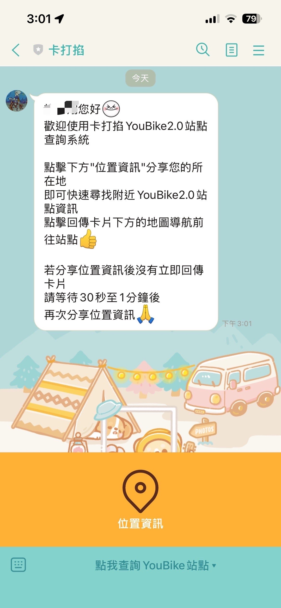
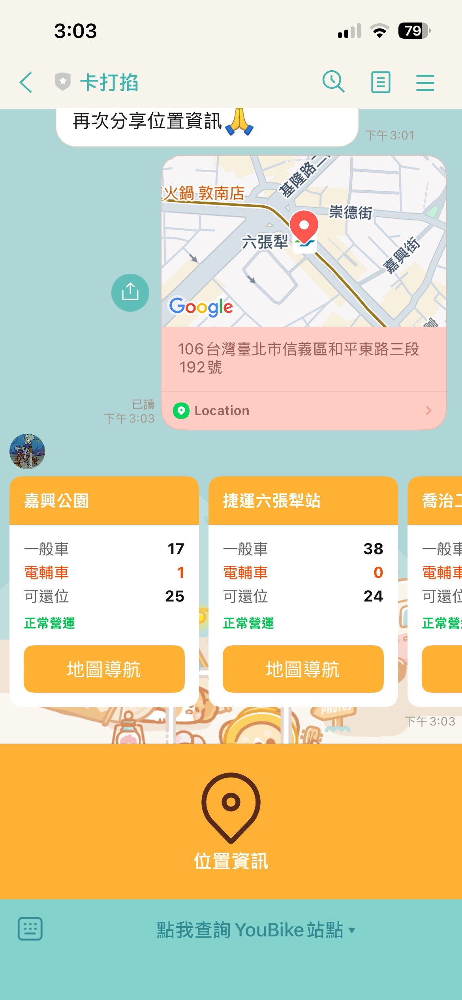

# 卡打掐 YouBike 2.0 站點查詢機器人

本專案是一個基於 Node.js 開發的 LINE 機器人，旨在協助使用者透過地理位置分享，快速查詢距離最近的 YouBike 2.0 站點資訊，包含即時可借車輛與可還車位數。

---

## 1. 機器人資訊

* **LINE 好友 ID**: @794wpooa
* **LINE 好友 QR Code**:

---

## 2. 功能介紹

使用者加入好友後，請按照以下步驟操作：

1.  **開啟選單**: 點擊聊天畫面下方的圖文選單。
2.  **分享位置**: 選擇「位置資訊」功能並發送當前所在地座標。
3.  **即時回覆**: 機器人將回覆距離最近的站點資訊卡片。
4.  **地圖導航**: 點擊卡片下方的導航按鈕，即可開啟地圖導引至該站點。

---

## 3. 使用技術與環境

* **開發語言**: Node.js
* **部署平台**: Render
* **通訊框架**: LINE Messaging API

---

## 4. 使用 API 來源

本專案介接 TDX 運輸資料流通服務（Transport Data eXchange）：

1.  **指定 [坐標][範圍] 之全臺公共自行車即時車位資料 v2**
    * 用途：取得站點即時剩餘車輛與空位數。
    * [API 連結](https://tdx.transportdata.tw/api-service/swagger/advanced/1a723c95-9edf-4dc9-9892-6cdbab40b7a9#/Bike%20Advanced(Nearby)/BikeApi_Availability_AllCity_NearBy_2871)

2.  **指定 [坐標][範圍] 之全臺公共自行車租借站位資料 v2**
    * 用途：取得站點基本資訊（名稱、經緯度）。
    * [API 連結](https://tdx.transportdata.tw/api-service/swagger/advanced/1a723c95-9edf-4dc9-9892-6cdbab40b7a9#/Bike%20Advanced(Nearby)/BikeApi_Station_AllCity_NearBy_2870)

---

## 5. 預覽

